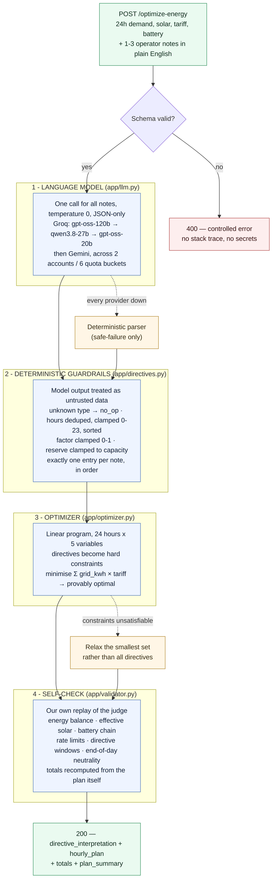

# GridWise LLM — Smart Campus Energy Optimization

BUP CSE Fest 2026 · Hackathon · Online Preliminary

An HTTP service that reads short natural-language notes from campus energy operators,
converts them into structured scheduling constraints using a language model, validates
those constraints deterministically, and returns a cost-minimal, fully valid 24-hour
electricity schedule.

| | |
|---|---|
| **Live base URL** | **https://power-puff.onrender.com** |
| **Health** | [`GET /health`](https://power-puff.onrender.com/health) → `{"status":"ok"}` |
| **Main endpoint** | `POST /optimize-energy` |
| **Docker image** | `warmther1990/gridwise-llm:1.0.0` <br>digest `sha256:15390b2f142411d9c5b3b5e9c60c3670b5466c885890a683ff6e259cafd78349` |
| **Model / provider** | Primary: **Groq** `openai/gpt-oss-120b` (OpenAI-compatible API), cascading to `qwen/qwen3.8-27b` and `openai/gpt-oss-20b`. Fallback: **Google Gemini** `gemini-3.5-flash` and its lite variants |
| **Optimizer** | Linear programming — PuLP with the bundled CBC solver |

---

## Architecture at a glance



**The key idea:** the language model *suggests*, deterministic code *decides*. The model's
structured output is what becomes the optimizer's constraints — nothing downstream can
invent a directive the model did not identify — but every value it returns is validated,
clamped, or discarded before it reaches the solver. Orange boxes are safe-failure paths:
the service always answers with a valid 24-hour plan rather than an error.

---

## 1. Quickstart from a clean machine

Requires Python 3.10+ (developed on 3.13, container runs 3.12). No database, no build step.

```bash
git clone https://github.com/Nakib-Saleh/Power_Puff.git
cd Power_Puff

python -m venv .venv
# Linux/macOS:
source .venv/bin/activate
# Windows PowerShell:
# .venv\Scripts\Activate.ps1

pip install -r requirements.txt

# Supply an API key (see section 4). On Linux/macOS:
export OPENAI_COMPAT_API_KEYS=your_groq_key_here
# Windows PowerShell:
# $env:OPENAI_COMPAT_API_KEYS = "your_groq_key_here"

uvicorn app.main:app --host 0.0.0.0 --port 8000
```

The service is ready immediately — there is no model download, no training, and no
warm-up step.

### Check it is alive

```bash
curl http://127.0.0.1:8000/health
# {"status":"ok"}
```

### Run one public sample against it

```bash
curl -X POST http://127.0.0.1:8000/optimize-energy \
  -H "Content-Type: application/json" \
  -d '{
    "scenario_id": "GRID-DEMO",
    "operator_notes": [
      "Solar output will drop to about 20% from 1 PM to 3 PM.",
      "The cafeteria menu changes tomorrow."
    ],
    "hours": [
      {"hour":0,"demand_kwh":90,"solar_kwh":0,"tariff_bdt_per_kwh":6},
      {"hour":1,"demand_kwh":85,"solar_kwh":0,"tariff_bdt_per_kwh":6},
      {"hour":2,"demand_kwh":80,"solar_kwh":0,"tariff_bdt_per_kwh":5},
      {"hour":3,"demand_kwh":80,"solar_kwh":0,"tariff_bdt_per_kwh":5},
      {"hour":4,"demand_kwh":85,"solar_kwh":0,"tariff_bdt_per_kwh":5},
      {"hour":5,"demand_kwh":95,"solar_kwh":0,"tariff_bdt_per_kwh":6},
      {"hour":6,"demand_kwh":110,"solar_kwh":5,"tariff_bdt_per_kwh":8},
      {"hour":7,"demand_kwh":130,"solar_kwh":20,"tariff_bdt_per_kwh":10},
      {"hour":8,"demand_kwh":150,"solar_kwh":50,"tariff_bdt_per_kwh":12},
      {"hour":9,"demand_kwh":165,"solar_kwh":90,"tariff_bdt_per_kwh":14},
      {"hour":10,"demand_kwh":175,"solar_kwh":130,"tariff_bdt_per_kwh":16},
      {"hour":11,"demand_kwh":180,"solar_kwh":160,"tariff_bdt_per_kwh":16},
      {"hour":12,"demand_kwh":185,"solar_kwh":180,"tariff_bdt_per_kwh":15},
      {"hour":13,"demand_kwh":180,"solar_kwh":170,"tariff_bdt_per_kwh":14},
      {"hour":14,"demand_kwh":170,"solar_kwh":140,"tariff_bdt_per_kwh":13},
      {"hour":15,"demand_kwh":165,"solar_kwh":90,"tariff_bdt_per_kwh":14},
      {"hour":16,"demand_kwh":170,"solar_kwh":45,"tariff_bdt_per_kwh":18},
      {"hour":17,"demand_kwh":185,"solar_kwh":10,"tariff_bdt_per_kwh":22},
      {"hour":18,"demand_kwh":205,"solar_kwh":0,"tariff_bdt_per_kwh":28},
      {"hour":19,"demand_kwh":215,"solar_kwh":0,"tariff_bdt_per_kwh":30},
      {"hour":20,"demand_kwh":205,"solar_kwh":0,"tariff_bdt_per_kwh":26},
      {"hour":21,"demand_kwh":175,"solar_kwh":0,"tariff_bdt_per_kwh":18},
      {"hour":22,"demand_kwh":135,"solar_kwh":0,"tariff_bdt_per_kwh":10},
      {"hour":23,"demand_kwh":105,"solar_kwh":0,"tariff_bdt_per_kwh":7}
    ],
    "battery": {
      "capacity_kwh": 220, "initial_energy_kwh": 110, "minimum_energy_kwh": 40,
      "max_charge_kwh_per_hour": 50, "max_discharge_kwh_per_hour": 50
    }
  }'
```

**Expected result:** HTTP 200. `directive_interpretation` has two entries — note 0 as
`solar_reduction` with `{"hours":[13,14],"factor":0.2}` and `applies: true`, note 1 as
`no_op` with `applies: false` and a null adjustment. `hourly_plan` has 24 rows, the
battery ends hour 23 back at 110 kWh, and the three totals match the plan.

---

## 2. Running the full public sample suite

Two scripts, both included in the repository.

### Offline — no server and no API key needed

```bash
python scripts/check_samples.py
```

This does two things. First it replays the **organizer's own reference plans** from
`BUP_CSE_FEST_2026_Preli_Public_Sample_Cases.json` through our independent validator;
all 10 must report `PASS`, which confirms our reading of the energy rules matches the
specification. Second it feeds the organizer's expected directives into our optimizer
and compares costs.

Expected output ends with:

```
  projected optimization score: 10.00 / 10

RESULT: all checks passed.
```

### End-to-end against a running service

```bash
python scripts/test_api.py                          # local
python scripts/test_api.py https://power-puff.onrender.com   # deployed
```

For each of the 10 samples this checks the HTTP status, the exact response schema, the
interpretation against ground truth, the plan's validity replayed against the
**ground-truth** directives (not our own), the cost ratio, and the response time.
Expected output ends with `RESULT: all good.`, an interpretation accuracy of `18/18`,
an optimization score of `10.00 / 10`, and a p95 under 5 seconds.

### Hostile-input check

```bash
python scripts/test_robustness.py
```

Fires 14 deliberately broken or adversarial requests (invalid JSON, 23 hours, 25 hours,
duplicate hours, zero notes, four notes, blank notes, negative demand, an impossible
battery, and prompt-injection attempts in the operator notes) and then confirms the
service is still healthy. Expected: `RESULT: survived everything.`

---

## 3. Architecture in detail

The diagram at the top of this README gives the overview. This section spells out
what each stage actually does, in text form.

```
  operator_notes (1-3 sentences of ordinary English)
            |
            v
  [ 1. LANGUAGE MODEL ]  app/llm.py
      One call covers all notes. Temperature 0, JSON-only response mode.
      Emits a flat structure: directive_type + hours + one numeric field.
      Several API keys rotate on rate limits; a second provider takes over
      if the first is unavailable.
            |
            v
  [ 2. DETERMINISTIC GUARDRAILS ]  app/directives.py
      Model output is untrusted data. Unknown directive types are discarded.
      Hours are deduplicated, bounded to 0-23 and sorted ascending. A factor
      outside 0-1 is clamped (and a reduction reported the wrong way round is
      corrected). Reserves are clamped to battery capacity, grid caps to >= 0.
      `applies` is forced consistent: false only for no_op. Exactly one entry
      is produced per note, in note_index order, whatever the model returned.
            |
            v
  [ 3. OPTIMIZER ]  app/optimizer.py
      A linear program over 24 hours with 5 variables per hour. The validated
      directives become hard constraints: reduced solar bounds, raised battery
      floors, zeroed charge/discharge in forbidden windows, capped grid import.
      Objective: minimise sum(grid_kwh * tariff). The solver returns a provably
      optimal schedule in roughly 50 ms.
            |
            v
  [ 4. SELF-CHECK ]  app/validator.py
      Our own copy of the judge replays the finished plan hour by hour before
      it is returned: energy balance, effective solar, battery chain, bounds,
      rate limits, every directive window, end-of-day neutrality, and totals
      recalculated from the plan itself.
            |
            v
  response JSON
```

**Why the language model is genuinely in the path.** The structured interpretation the
model produces is what becomes the optimizer's constraints — reduced solar, raised
battery floors, forbidden charge/discharge hours, grid caps. Nothing downstream can
reconstruct a directive the model did not identify. The guardrail layer only ever
*narrows* what the model proposed; it never invents a directive.

### Degradation ladder

Every step down still returns a valid 24-hour plan with HTTP 200, because an error
response would forfeit the whole case:

1. Primary provider (Gemini) answers → normal path.
2. Primary exhausted or unreachable → secondary OpenAI-compatible provider.
3. Both unavailable → a deterministic pattern-matching parser (`rule_based` in
   `app/llm.py`). **This is a safe-failure path only, never the primary interpreter.**
4. Interpretation fails entirely → all notes treated as `no_op` and a valid plan is
   still produced.
5. Directive combination infeasible → the optimizer relaxes, and finally falls back to
   a grid-only schedule that is always valid.

Identical notes are cached, so repeated hidden cases cost no model calls and return
almost instantly.

---

## 4. Configuration

All configuration is by environment variable. **No secret values appear anywhere in this
repository**; `.env.example` documents names only.

| Variable | Required | Default | Purpose |
|---|---|---|---|
| `OPENAI_COMPAT_API_KEYS` | yes* | — | Primary interpreter. One key or several comma-separated. Groq by default. |
| `OPENAI_COMPAT_BASE_URL` | no | `https://api.groq.com/openai/v1` | Primary provider base URL. Any OpenAI-compatible endpoint works. |
| `OPENAI_COMPAT_MODEL` | no | `openai/gpt-oss-120b,qwen/qwen3.8-27b,openai/gpt-oss-20b` | Comma-separated cascade. Groq meters its free tier *per model*, so a rate-limited model rolls to the next. |
| `GEMINI_API_KEYS` | yes* | — | Fallback interpreter. One key or several comma-separated; keys rotate on quota errors. `GEMINI_API_KEY` also accepted. |
| `GEMINI_MODEL` | no | `gemini-3.5-flash,gemini-3.5-flash-lite,gemini-3.1-flash-lite,gemini-3-flash-preview,gemini-flash-latest` | Fallback cascade; the first model that answers is used. |
| `LLM_TIMEOUT_SECONDS` | no | `12` | Per-attempt model timeout, kept far below the 30 s request limit. |
| `PORT` | no | `8000` | Port the service binds on (always `0.0.0.0`). |

\* At least one of the two providers must be configured. With both set, the service
survives either one being rate-limited or down. With neither, it still returns valid
plans via the deterministic fallback parser, but that does not satisfy the challenge's
LLM requirement.

Free keys: Groq at <https://console.groq.com/keys>, Gemini at <https://aistudio.google.com/apikey>.

---

## 5. Docker fallback

```bash
docker pull warmther1990/gridwise-llm:1.0.0

docker run --rm -p 8000:8000 \
  -e OPENAI_COMPAT_API_KEYS=your_groq_key_here \
  -e GEMINI_API_KEYS=your_gemini_key_here \
  warmther1990/gridwise-llm:1.0.0

curl http://127.0.0.1:8000/health
# {"status":"ok"}
```

The image binds `0.0.0.0` on the port given by `PORT` (default 8000), exposes 8000,
runs as a non-root user, has a built-in healthcheck, and **contains no baked-in
credentials** — the key is supplied at run time.

To build it yourself:

```bash
docker build -t gridwise-llm:local .
docker run --rm -p 8000:8000 -e OPENAI_COMPAT_API_KEYS=your_groq_key_here gridwise-llm:local
```

Without an API key the container still starts and answers every request with a valid
plan, using the deterministic fallback interpreter.

---

## 6. API contract

### `GET /health`
`200` → `{"status":"ok"}`

### `POST /optimize-energy`

| Status | When |
|---|---|
| `200` | Successful interpretation and optimization |
| `400` | Malformed JSON, or a structurally invalid request (wrong hour count, duplicate hours, 0 or 4+ notes, blank notes, missing battery, incoherent battery values) |
| `500` | Controlled internal error — a short message only, never a stack trace or a secret |

Request and response follow the Problem Statement exactly. Response fields:
`scenario_id`, `directive_interpretation`, `hourly_plan`, `total_grid_kwh`,
`total_cost_bdt`, `peak_grid_kwh`, `plan_summary`. Interactive docs are served at
`/docs`.

Supported directive types: `solar_reduction`, `minimum_battery_reserve`,
`no_charge_window`, `no_discharge_window`, `max_grid_window`, `no_op`.

Conventions we follow: time windows are start-inclusive and end-exclusive, so
1 PM–3 PM is `[13, 14]`; `factor` is the fraction of solar that *remains*, so an 80%
reduction is `0.2`; reserves given as a percentage are converted against the battery
capacity in the request; numeric comparisons use a 0.01 tolerance.

---

## 7. Repository layout

```
app/schemas.py      request validation (strict, so bad requests get 400)
app/directives.py   directive types + guardrails over model output
app/llm.py          prompt, provider clients, key rotation, cache, safe-failure parser
app/optimizer.py    the linear program and plan construction
app/validator.py    independent replay of a plan — our own copy of the judge
app/main.py         FastAPI endpoints and failure policy
scripts/check_samples.py    offline: organizer reference plans + our optimizer
scripts/test_api.py         end-to-end suite against a running service
scripts/test_robustness.py  14 hostile / malformed requests
scripts/burst_test.py       sustained load, distinct paraphrased scenarios
scripts/parallel_test.py    concurrent load at a chosen concurrency level
scripts/pick_model.py       benchmarks candidate models on the sample notes
Dockerfile                  container fallback image
.env.example                environment variable names (no values)
```

---

## 8. Dependencies and credits

| Package | Licence | Used for |
|---|---|---|
| [FastAPI](https://fastapi.tiangolo.com/) | MIT | HTTP layer |
| [Uvicorn](https://www.uvicorn.org/) | BSD-3 | ASGI server |
| [Pydantic](https://docs.pydantic.dev/) | MIT | Request schema validation |
| [PuLP](https://coin-or.github.io/pulp/) | MIT | Linear programming modelling, bundled CBC solver |
| [CBC](https://github.com/coin-or/Cbc) | EPL-2.0 | The LP solver itself |
| [HTTPX](https://www.python-httpx.org/) | BSD-3 | Async HTTP client for model calls |
| Google Gemini API | — | Operator-note interpretation |

An AI coding assistant was used during development. The architecture, the optimization
model, the guardrail design, and the validation logic are the team's own work.

---

## 9. Known limitations

- **Battery efficiency is modelled as lossless**, matching the Problem Statement's
  energy-balance equation. A real system would have round-trip losses.
- **No grid export.** Surplus solar is curtailed, as the specification requires.
- The optimizer may charge and discharge within the same hour internally; this is
  collapsed into a single net action per hour before the response is built, which is
  cost-neutral without efficiency losses.
- **Directive conflicts are not reconciled semantically.** The specification guarantees
  scored scenarios are feasible. If an infeasible combination did arrive, the service
  relaxes to a valid schedule rather than returning an error.
- If a note contains a directive type outside the six supported ones, it is treated as
  `no_op` by design rather than approximated.
- The deterministic fallback parser is deliberately conservative — it prefers `no_op`
  over a guess, so unusual phrasings may be missed when every model provider is down.

## 10. Secret handling

No API keys, tokens, or `.env` files are committed. `.gitignore` excludes `.env`. Keys
are read from environment variables at runtime only, are never logged, and never appear
in an API response — error bodies carry a short message and a field name, never a stack
trace. The published Docker image contains no credentials.
